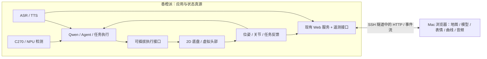

# 小沫机器人：功能迁移、无硬件仿真与性能优化总方案

记录日期：2026-09-25。目标：以 Orange Pi 3B 为真实运行与开发环境、Mac 为操作和可视化终端，逐步补齐小沫机器人原项目能力，形成能演示、能解释、可记录的个人作品。

本文是代码核查与一手资料调研形成的**实施方案**，不是这些功能已经全部实现的验收报告。本轮没有安装模拟器、启动录音/相机、运行训练、修改业务代码或停止现有进程。

## 1. 建议先读的结论

可以继续做很多事情，不必等轮子、电机、舵机、雷达到齐。最合适的主线是：

> 当前真实的语音/Qwen/Agent/视觉链路 → 可观测控制台与 Mac 语音输出 → 虚拟表情和头部 → 虚拟底盘及运动反馈 → 语音任务与地图导航 → 按瓶颈优化 → 未来替换为真实硬件。

其中“模拟”要分清四种证明力度：

| 层级 | 例子 | 能证明什么 | 不能证明什么 |
|---|---|---|---|
| 接口替身 | 接受导航任务，随后按脚本返回成功/取消 | Agent、任务状态机、错误处理与 UI 是否衔接 | 规划、避障、定位是否正确 |
| 数据回放 | WAV、视频、检测框、LaserScan bag | 同一输入下算法和业务链路的行为 | 输入是否会随机器人动作正确变化 |
| 运动学闭环 | 速度积分得到位姿，位姿改变合成雷达/目标投影 | 控制、路径、目标到达、超时与反馈闭环 | 真实轮胎、碰撞接触、打滑、电机响应 |
| 物理仿真 | Gazebo/Webots 的刚体、碰撞、传感器 | 特定物理模型下的控制与导航 | 实车标定、真实噪声、电气与机械可靠性 |

**推荐首选第三种，并结合第二种保留可重复输入；不要把第一种界面演示叫作导航完成。** 原项目的独立 C++ 教学导航模拟器可辅助学习，但其 README 明确不是完整 AMCL/SLAM/Nav2 实现。

“板子不渲染、Mac 渲染”可以实现，但要区分：网页/机器人模型/地图的显示可以全部在 Mac；仿真相机生成像素、GPU 雷达生成观测仍是模拟器服务器的工作。后者若也要从板子移走，就把对应仿真服务器一起放在 Mac 或其 Linux 虚拟机。

## 2. 本次证据、环境与现状

### 2.1 查的是哪份代码

- 原项目：`/Users/syz/code/robot`，实际指向 `/Users/syz/code/robotics/robot`；HEAD 为 `22cd28d2d63ba1165f3fbceba205e02ed94f204d`。既有 ROS 1 应用，也有部分 ROS 2 代码、离线语音代码、MCU 工程和第三方依赖。本地 `prototype_nav_cpp` 等内容未被该HEAD跟踪，应另外保存，不能仅凭commit宣称可复现。
- 当前应用：Orange Pi 的 `/home/orangepi/code/ros-robot`；HEAD 为 `b461ab905a2c4a92e3531fefcd4814d1b6c91c9a`，**另有未提交的启动器/文档/测试修改**。以下结论以 SSH 读取的工作目录内容为准，不能只用 HEAD 复现全部现状。
- 环境操作记录仓库：`/Users/syz/code/robotics/oragnepi-pratice`。其中早期迁移评估包含历史状态，本报告以当前应用源码纠正它，不把旧方案当作已实现事实。
- 历史运行证据：[大模型端侧实践-步骤记录](/Users/syz/code/obsidian_本地知识库/收件箱/步骤记录/大模型端侧实践-步骤记录.md)，特别是语音文件验收、合成框验收和网页链路记录。绝对本地链接用于Mac知识库；板端阅读时以列出的路径/源码相对路径定位。

### 2.2 实机只读观测

| 项目 | 本次结果 | 对方案的影响 |
|---|---|---|
| 板卡 | Orange Pi 3B / RK3566 / ARM64 / 四核 A55 / 4GB | 优先轻量 2D 仿真，避免默认堆叠大型服务 |
| 系统 | Ubuntu 20.04 / Rockchip 5.10.160 内核 / ROS 2 Foxy | 不照抄 Jazzy/Rolling 的包名、插件与参数 |
| 内存快照 | 总计约 3.8GiB，可用约 2.0GiB，swap 已用约 215MiB | 这是当时快照，不能视为所有功能同时运行的预算 |
| 编辑器负载 | Pylance 约占系统内存 16.8%，一个扩展宿主约 11.0% | 远程开发工具也消耗板端资源；性能报告需记录编辑器状态 |
| 温度快照 | `soc-thermal` 约 43.1°C | 不是高负载温度/降频测试 |
| 已装相关包 | `diagnostic_msgs`、`robot_state_publisher`、rosbag2、tracetools | 可以优先复用；tracetools 存在不等于整套 tracing 已可用 |
| 未见相关包 | 在 `/opt/ros/foxy/share` 未见 Nav2、SLAM Toolbox、Gazebo、Foxglove/rosbridge | 只说明该目录中未安装，未穷尽其他 overlay/容器 |
| llama-server | 版本输出 `37 (22cd28d)`，Linux aarch64；help 包含 `--metrics` 和 JSON schema 选项 | 可以做端侧指标与结构化输出实验，不必先升级 llama.cpp |
| Mac | ARM64 / macOS 26.6.2 / 16GiB 内存 | 浏览器渲染合适；Linux VM 需要单独验证图形与资源占用 |

Foxy 已于 2023-06-20 结束支持。当前系统可以继续服务现有原型；新增导航/仿真要固定兼容版本，或另建受支持版本的实验环境。不能为了装模拟器直接破坏已有 Rockchip 驱动与模型组合。依据：[ROS 官方发行版表](https://raw.githubusercontent.com/ros2/ros2_documentation/rolling/source/Releases.rst)。

### 2.3 当前已迁移内容与明确边界

当前仓库有 9 个应用包：`robot_bringup`、`robot_interfaces`、`robot_agent`、`robot_voice`、`usb_camera`、`img_decode`、`rknn_yolov6`、`object_track`、`web_video_server`。

| 能力 | 当前实现 | 还缺什么 |
|---|---|---|
| 相机 | C270 → V4L2 MJPEG → ROS 压缩图 | 文件相机输入、可靠断线恢复、相机状态回执 |
| 解码 | **OpenCV `imdecode` + CPU 色彩转换/缩放** | 原工程 MPP/RGA 后端没有接到当前实现 |
| 检测 | RKNN YOLOv6 / 板端 NPU / 检测框及标注图 | 分阶段性能统计、稳定目标 ID、视觉语义查询 |
| 跟踪 | 选最大 person 框，按水平偏差计算角速度；线速度固定 0 | 距离控制、稳定关联、多目标切换策略 |
| dry-run | **只日志预览，不发布 Twist**，包括配置为 `/tracking/cmd_vel_safe` 时 | 图形化预览事件、模拟专用输出适配器 |
| Agent | `start_camera`、`stop_camera`、`start_tracking`、`stop_tracking`、`status` | 原工程的头部、表情、导航、音量、音乐等能力 |
| LLM 可执行白名单 | 相机与跟踪联合状态查询、启动相机、停止相机、启动跟踪 | Agent 支持 `stop_tracking` 不代表模型侧同名能力已获映射 |
| 离线 ASR | 双语小 Zipformer，CLI 按 WAV/一次录音调用 | 常驻推理、流式送音、自动端点、唤醒 |
| 离线 TTS | Sherpa/Piper `zh_CN-xiao_ya-medium`，CLI 生成 WAV | 原项目 SummerTTS 未原样迁移；当前缺外放硬件，Mac 播放尚未实现 |
| 语音交互 | 一次触发，默认录音窗口 8 秒；演示入口默认 WAV | 没有完整持续对话、打断和多客户端回合管理 |
| 网页 | 原图/检测 MJPEG、帧率与存活状态、五个 Agent 命令 | LLM 文本框、语音状态、任务/地图/表情、系统监控 |
| 默认验收 | 固定 WAV + 合成检测框，真实节点参与 | 不能等同实时人像检测精度、实体跟随或导航验收 |

当前源码锚点，均相对于板端应用根目录：

- `ros2_ws/src/img_decode/src/img_decode_node.cpp:46`：CPU 解码；`:67`：复制到 ROS Image。
- `ros2_ws/src/object_track/include/object_track/tracking_output.hpp:21`：preview/publish 分界。
- `ros2_ws/src/object_track/src/object_track_node.cpp:81`：最大框选择；`:97`：线速度固定为 0。
- `ros2_ws/src/robot_agent/robot_agent/llm_ros_node.py`：`APPROVED_FUNCTION_ALLOWLIST`、命令等待与软件状态回执。
- `ros2_ws/src/robot_voice/robot_voice/voice_frontend_node.py`：单回合、固定录音、临时文件与响应等待。
- `ros2_ws/src/robot_bringup/scripts/voice_tracking_acceptance_probe.py`：合成检测框与不发布运动的验收。

## 3. 不需要新增机器人硬件的迁移清单

这里“不需要新增硬件”仍允许使用已有 Orange Pi、C270 与 Mac。网络、模型文件、资源许可也可能是前置条件。

工作量：S=局部模块/页面；M=跨模块联调；L=新子系统。它是相对范围，不是工期承诺。P1=近期主线；P2=后续增强；P3=选修分支。

| 功能 | 原代码/资产 | 具体迁移方法 | 可看到的成果 | 建议 |
|---|---|---|---|---|
| 系统监控 | `src/monitor` | 保留 `/proc` 采样算法；ROS 1 接口改 ROS 2；增加温度、频率和节点心跳 | Mac 看 CPU/内存/温度/网络、哪些节点在工作 | P1/M |
| 节点与进程关联 | monitor 的 register/unregister 服务、`offline-agent/monitor_processes.py` | PID+启动时间识别进程；进程 RSS 和节点心跳分开展示 | 能区分进程存在、节点存在、数据真的在流动 | P1/M |
| 运行记录与回放 | monitor 原 rosbag1 写入、现有 ROS 消息 | 小数据用 JSONL/CSV；选定 topics 用 rosbag2 | 演示结束有可复现记录，而不是截图猜测 | P1/S–M |
| 完整控制台 | `web_controller.py`、`templates/` | 迁移交互设计，控制请求通过应用 API/ROS 适配；保留当前网页入口 | 输入文本、操作技能、看执行与失败原因 | P1/M |
| 表情动画 | `src/agent/emoji.py`、`image/` | 把表情状态与 LCD 绘制分离；Mac Canvas 播放本地静态资源 | 小沫在屏幕上思考、微笑、睡眠、回应 | P1/M |
| 音频播放终端 | 当前 TTS WAV、原音量/播放逻辑 | 板端合成，临时 HTTP 资源交给 Mac `<audio>`；单轮完成后回收 | 没有板端音箱也能听到真实板端 TTS | P1/M |
| 软件状态查询 | 原 executor 与当前 Agent | 区分 desired/observed/stale；对相机用新帧确认，对模型用健康检查 | “相机已开启”有状态证据 | P1/M |
| 相机/跟踪细粒度启停 | `robot_following_controller.py` | 移植 enable/disable/query 语义，逐项映射当前白名单 | 摄像头、检测、跟踪可分别观察 | P1/M |
| URDF/TF 模型显示 | `test11_description` | ROS 2 description 包；先静态显示，再修正活动关节 | Mac 看机器人模型、坐标轴与头部角度 | P1/M |
| 地点管理 | `navigation_controller.py` 的 location 字典 | 迁出硬编码坐标到 YAML/JSON；带 map_id、姿态与命名 | 增删查“厨房/起点”，无需移动底盘 | P1/S |
| 连续语音会话状态 | 原 `asr.py` 与离线 ASR 定制入口 | 独立会话机：待机→听音→识别→推理→播报→待机 | 不用每次手动敲 ROS service | P2/M |
| 流式 ASR/端点 | `offline-agent/voice` 的定制麦克风程序 | 复用模型；常驻 Sherpa worker，分块接收音频 | 句尾结束即识别，无需固定等 8 秒 | P2/M |
| 唤醒词/VAD | 原唤醒流程 + Sherpa 官方 KWS/VAD | VAD 判语音段，KWS 判特定唤醒；专用模型与阈值单独配置 | 安静时待机、指定词唤醒 | P2/M |
| 对话历史/记忆 | `src/agent/llm.py` 的 save/load/summarize_memory | 会话内有限历史先做；持久记忆显式启用、可查看/删除 | 后一句能承接前一句，保持上下文预算 | P2/M |
| 音量/静音/播放队列 | `function_executor.py`、`cloud_music.py` | `AudioOutput` 抽象，Mac 浏览器先实现；离线音频库先行 | 语音暂停、调音量、播放本地音频 | P2/M |
| 网页设置与配置 | `config_manager.py`、原 settings 页面 | 限定可改字段、类型校验、注明立即生效/需重启 | 改帧率或音量不需要编辑多个文件 | P2/M |
| 联网搜索 | `search_engine.py`，当前原Agent未接线 | 可选网络工具，独立超时/缓存；接入注册表属于新增集成 | 网络可用时搜索；断网时清楚降级 | P3/M，非离线能力 |
| 云端 LLM/ASR/TTS | 原 `asr.py`、`llm.py` | 作为可切换 provider，用同一业务接口 | 对比本地与云端体验 | P3/M，需网络/凭据 |
| 云音乐 | `cloud_music.py` | 独立网络音源后端；没有网络时选本地音频 | 搜索/下一首/队列 | P3/M，非离线主线 |
| 导航教学算法 | `prototype_nav_cpp` | 独立工具保留，输出 CSV/地图；可加 ROS 2 适配 | 看 A*、DWA 风格轨迹与漂移概念 | P3/M，不包装成 Nav2 |

表情、记忆和音乐属于原项目已有设计；“Mac 播放”和“可观测回合”是适应当前硬件的扩展。原 cloud/离线两条实现应分别说明，不能因为都叫小沫就宣称与课程全部相同。

重要源代码入口：

- [原函数注册表](/Users/syz/code/robotics/robot/src/agent/function_executor.py:286)
- [原导航控制器](/Users/syz/code/robotics/robot/src/agent/navigation_controller.py:23)
- [原 monitor 主程序](/Users/syz/code/robotics/robot/src/monitor/src/main.cpp:24)
- [原 Web 控制 API](/Users/syz/code/robotics/robot/web_controller.py:547)
- [原对话和记忆](/Users/syz/code/robotics/robot/src/agent/llm.py:189)

## 4. 依赖缺失硬件的功能，怎样模拟

| 缺失硬件/能力 | 当前可做的替代方案 | 需要实现的接口 | 能验收的部分 | 仍要实物验收的部分 |
|---|---|---|---|---|
| 轮子/驱动板/底盘 | 差速运动学模拟，速度输入积分位姿 | Twist 输入、Odometry、TF、JointState 输出 | 前进/转向/停止、超时、到达逻辑 | 最大速度、刹车距离、打滑、负载 |
| 编码器 | 由左右轮角速度生成脉冲，加入可选噪声/丢计数 | 编码器计数、里程计 | 单位换算、方向、里程计积分 | 实际分辨率、左右轮差异、标定 |
| MCU 串口 | PTY 虚拟串口 + 按原协议实现的设备模拟器 | 原收发帧解析/校验/超时 | 拆包/粘包/校验/断线/重连、字段符号 | UART 电平、电磁干扰、MCU 中断时序 |
| 电机/PID | 一阶电机模型，PWM→轮速→编码器 | 单独编译可测试 PID/协议核心 | 限幅、积分累积、阶跃响应、异常反馈 | 真电机 PID 参数与负载稳定性 |
| 头部舵机 | 同一动作轨迹驱动虚拟关节和 Mac 机器人动画 | HeadMotion action / joint states | 点头、摇头、转向、取消、角度限制 | 零点、脉宽、堵转、电流与机械干涉 |
| LCD | 浏览器播放原表情帧 | Emotion state/event | 表情选择、动作节奏、与语音同步 | SPI、刷新率、色彩、接线 |
| 板端扬声器 | 板端生成 WAV，Mac 通过浏览器播放 | 带 turn_id 的短期音频资源与播放回执 | 合成质量、端到端听感、播放时序 | 板端声卡/功放/喇叭效果 |
| 激光雷达 | 在 2D 世界上 CPU 射线投射，或有来源的 LaserScan bag | LaserScan + laser frame + 时间戳 | 建图、定位、costmap 接口与虚拟避障 | 雷达盲区、反光、真实距离误差 |
| 真实导航场地 | 仿真地图 + 虚拟 scan/odom + 真 Nav2 | NavigateToPose、TF、map、scan、cmd_vel | 规划、到达、取消、恢复、重规划 | 实车定位鲁棒性和避障安全 |
| SLAM | 未知给算法的世界 + 合成 scan + 带误差 odom | scan、odom、TF | 实际运行 SLAM 算法并形成地图 | 真实反射/动态人群/轮滑 |
| 人物跟随运动闭环 | 虚拟人物位置→随机器人位姿变化的图像投影/检测框 | 检测输入、预览输出或模拟速度输出 | 控制误差收敛、丢目标停止、模式切换 | 合成框绕过检测器，不能证明 YOLO 精度 |
| 完整视觉仿真 | Mac 仿真服务器生成相机图，发送到板端 NPU | Image/CompressedImage + 对齐时间戳 | 图像→NPU→控制→新图像的计算闭环 | 渲染域差异；与真实摄像头性能不同 |
| 实体巡检 | 仿真地点路线，视觉用已授权回放或虚拟场景 | 任务队列、导航、观察结果 | 任务编排、恢复、记录 | 场景真实可达性及传感效果 |

单独发布一个“假检测框”不是人物跟随闭环。必须让模拟机器人转动后，目标在图像中的位置相应变化；否则只能验证“输入偏差→输出角速度”这一半。

原 `base_control` 的 PID 与串口逻辑在上位机代码中也有实现，不应笼统说“控制都在 MCU”。迁移时从实际代码确定职责。源码中的串口失败/零值分支不等于有完整设备模拟器。

### 4.1 最轻的虚拟底盘

建议新建独立 `robot_sim` 包，核心数学不依赖 ROS，外层适配 ROS。先采用差速模型：

```text
x_next = x + v * cos(theta) * dt
y_next = y + v * sin(theta) * dt
theta_next = theta + omega * dt
wheel_left  = (v - omega * wheel_separation / 2) / wheel_radius
wheel_right = (v + omega * wheel_separation / 2) / wheel_radius
```

这是小时间步近似；需要更高精度时采用中点/圆弧积分。轮径、轮距、最大加速度都参数化，不能把原车常量当作你未来硬件的标定结果。

初始工程预算可设位姿积分 20–50Hz、UI 状态 5–10Hz、监控 1Hz、虚拟雷达 5–10Hz。它们是待测目标；观察板子负载后再调整。

输入超过有效期归零；模拟碰撞要显式标识，不能穿墙后仍报告到达。真值 `/sim/ground_truth` 与估计 `/odom` 分开，为后续定位实验留边界。

### 4.2 dry-run 与模拟后端怎样解耦

现有 `VelocityOutputPort` 已提供插拔入口，推荐扩展为：

```text
跟踪/导航/人工控制
    → 控制权仲裁 + 速度限制 + 命令超时
    → VelocityOutputPort
        ├─ PreviewOutput：发布只读决策事件，不输出执行速度
        ├─ SimOutput：仅向 /sim/.../cmd_vel 输出
        └─ HardwareOutput：未来真实底盘驱动
```

保留现有 dry-run 的“不执行”语义，不为了让虚拟车动就默默取消隔离。增加 `execution_backend=preview|sim|hardware` 这类明确配置，模拟 launch 不包含真实底盘驱动。

首版可只做 preview+sim 两种；hardware 未实现时明确拒绝选择它。发布模拟消息是有效执行，和只记日志是不同能力。Agent 回执应说明 backend、task_id 和当前完成状态。

原工程的许多绝对话题名（以 `/` 开头）不会自动随 ROS namespace 改变。隔离模拟时要逐项 remap 或改为相对名称，并使用不同 ROS domain/启动配置避免真实与合成输入同题混发。

### 4.3 机器人外形不能直接当作物理模型

`test11.xacro:136` 和 `:143` 的两个轮子关节 `j1/j2` 是 `fixed`。`test11.gazebo` 使用 `libgazebo_ros_control.so`，并存在与当前 link 名称不同的 `_1` reference。原 `gazebo.launch` 用 ROS 1 `spawn_model` 和 `empty_world.launch`。

因此迁移顺序是：

1. 复用 mesh，先确认比例、朝向和坐标树，得到静态显示。
2. 将轮关节改为正确轴向的连续关节；按实际结构增加头部关节，不能凭外形臆造已存在的自由度。
3. 使用简化碰撞体；复核质量、惯量、轮径和轮距。
4. 选定模拟器与 ROS 版本后重写插件/控制器，而不是修改 launch 后立即宣称可运动。

若只验证 ros2_control 接口，Foxy 自身有 `fake_components/GenericSystem`：主要把命令映射为状态，可验证控制器接线，但并非动力学仿真。[Foxy 官方 fake components 文档](https://github.com/ros-controls/ros2_control/blob/foxy/hardware_interface/doc/fake_components_userdoc.rst)。

## 5. 模拟器与 Mac/香橙派分工的选型

### 5.1 当前最合适：板端轻量模拟，Mac 浏览器绘制



板子计算坐标与状态，浏览器 Canvas/WebGL 绘制，Mac 扬声器播放已合成音频。浏览器掉线后板端任务状态仍由后台负责；不依赖浏览器动画帧率控制机器人。

优先沿用现有 Flask 服务，第一版低频 JSON 状态轮询即可；再按需要加入 SSE 单向事件流。WebSocket 是可选扩展，需要相应服务组件，并非 Flask 当前代码天然具有。[Flask 架构文档](https://flask.palletsprojects.com/en/stable/design/)。

功能上可分三个画面：

1. **交互面板**：文本/录音触发、识别结果、回复、播放、技能状态。
2. **机器人面板**：2D 地图、轨迹、目标点、雷达、机器人朝向；需要外观时加 3D 模型与表情。
3. **诊断面板**：资源曲线、阶段耗时、帧龄、失败原因、运行记录下载。

所有前端 JS、字体、模型、表情都本地服务，不依赖 CDN 才能称为断网可用。Mac 只显示时不需要安装 ROS。

### 5.2 各种可选方案的取舍

| 方案 | 板端工作 | Mac 工作 | 优势 | 成本/限制 | 本项目选择 |
|---|---|---|---|---|---|
| 自有 Web + 2D 模拟 | ROS/Agent、运动积分、轻量扫描、遥测 | 浏览器画图与播放 | 延续现有入口、无重型图形栈 | 要写小范围适配与 UI；不是物理仿真 | **近期首选** |
| Foxglove + bridge | ROS bridge 发布遥测 | Foxglove 3D/地图/图像/曲线 | 标准工具丰富，少写通用面板 | Foxy/ARM64 兼容与当前授权需确认 | 可选调试工具 |
| RViz2 分离显示 | 发布 TF/map/scan 等 | Linux VM 内运行 RViz2 | ROS 开发常用 | Apple Silicon 原生 ROS/RViz 非本项目已验环境；跨网 DDS复杂 | 需要 ROS 专业调试时引入 |
| 真 Nav2 + loopback | 可继续只跑现有 Foxy Agent | Ubuntu ARM64 VM 跑 Jazzy、Nav2 与 loopback | 没有 Gazebo 也能运行真实导航算法 | 跨版本边界要适配；有 VM 资源开销 | **导航首选实验环境** |
| Gazebo server 在板子、GUI 在 Mac | 物理、传感器生成、ROS bridge | GUI/显示 | 架构允许计算与显示分离 | RK3566 图形驱动/性能、Foxy 配套、Mac GUI 未验证 | 技术可研究，非首选 |
| Gazebo 全部在 Mac Linux 环境 | Agent 可留板端 | 仿真物理/传感器与显示 | 板端压力小，模拟更丰富 | VM GPU 不保证；图像网络带宽、跨版本联调 | 后期按需要做 |
| 原 C++ 教学模拟器 | 可执行算法实验、导出轨迹 | CSV 可视化 | 很轻、源码便于学习 | 不是完整 ROS 导航/物理仿真 | 保留为学习工具 |
| 只用固定 bag/视频 | 算法/感知回放 | 观察 | 复现方便 | 动作不能改变录制世界，非交互仿真 | 与闭环模拟配套 |

Foxglove 负责数据可视化，不是物理模拟器；RViz2 也不会替你生成物理世界。

### 5.3 Foxglove：值得用，但不能给出未经核验的一行安装承诺

官方支持 Mac Web/桌面客户端，ROS 数据通过 bridge 接入。当前 bridge 的 ROS 构建列表不包含 Foxy；所列容器镜像也不能默认用于这块 ARM64 板。历史 Foxy `rosdistro` 有 `rosbridge_suite`，所以可以评估固定兼容版 rosbridge + Foxglove 的 Rosbridge 连接，而不是直接安装最新 `foxglove_bridge`。

此外，当前官方 Live 文档对直接连接标注 developer seat 要求，不能假定所有版本/账户完全免费。实际可用性、离线方式、费用应在引入前确认。本方案自有网页不依赖它。[Foxglove ROS2 指南](https://docs.foxglove.dev/docs/getting-started/frameworks/ros2)、[bridge 构建支持](https://raw.githubusercontent.com/foxglove/foxglove-sdk/main/ros/README.md)、[Live 连接与功能](https://docs.foxglove.dev/docs/visualization/connecting/live)、[Foxy 发布清单](https://raw.githubusercontent.com/ros/rosdistro/master/foxy/distribution.yaml)。

### 5.4 Gazebo：无窗口不等于无渲染

Gazebo 将 server 和 GUI 分开，但相机、深度相机、GPU lidar 仍可能需要 server 的渲染系统。`gz sim -s` 只关闭 GUI；`--headless-rendering` 是利用 EGL 等在无显示服务器环境下渲染，并非取消图像生成。GPU 不可用时软件渲染可能进一步占 CPU。[Gazebo 架构](https://gazebosim.org/docs/harmonic/architecture/)、[Headless rendering](https://gazebosim.org/api/sim/8/headless_rendering.html)。

因此，“板子完全不做图形计算”的两个靠谱选项是：

- 板端只做 2D 数学模拟、CPU 射线雷达；Mac 绘制可视化场景。
- 相机等渲染传感器连同仿真服务器一起放在 Mac/Linux 主机，板端接收仿真输入。

Gazebo Classic 已在 2025 年 1 月结束支持。新的独立导航/仿真实验建议评估 Ubuntu 24.04 ARM64 + ROS 2 Jazzy；需要 3D 物理时再配官方组合 Gazebo Harmonic。当前 Foxy 不在现代 Gazebo 推荐矩阵中。[Classic 官方站](https://classic.gazebosim.org/)、[Gazebo/ROS 配套矩阵](https://gazebosim.org/docs/harmonic/ros_installation/)。

Harmonic 有 macOS 安装说明，但官方对 Mac GUI 稳定性有提示；不能据此保证 macOS 26.6.2 Apple Silicon 上现成可用。Linux VM 的图形加速也需先验证；Docker Desktop for Mac 不能因支持容器就被视为已能给 Gazebo 提供 GPU。[macOS 安装](https://gazebosim.org/docs/harmonic/install_osx/)、[运行限制](https://gazebosim.org/docs/harmonic/getstarted/)、[Docker Desktop GPU 文档](https://docs.docker.com/desktop/features/gpu/)。

### 5.5 真正的导航，优先复用 Nav2 loopback

Nav2 已有非物理的轻量 `nav2_loopback_sim`。本次核查的 Jazzy 源码 commit：`f4108e5b1c2bce804a1aa0c7be6673a8eb4a1501`，package 版本 `1.3.13`。该实现由速度积分理想 odom，提供 TF，并可根据静态地图生成 LaserScan。

其 README 前段仍有“不提供 sensor data”的旧文字，后段和实际源码却包含 scan。方案以该固定源码为准，不把网上旧描述或最新版参数套到 Foxy。未确认最早提供这些能力的二进制包版本，也没有在用户机器安装测试。[固定版本源码](https://raw.githubusercontent.com/ros-navigation/navigation2/f4108e5b1c2bce804a1aa0c7be6673a8eb4a1501/nav2_loopback_sim/nav2_loopback_sim/loopback_simulator.py)、[固定版本说明](https://raw.githubusercontent.com/ros-navigation/navigation2/f4108e5b1c2bce804a1aa0c7be6673a8eb4a1501/nav2_loopback_sim/README.md)。

它适合“目标→真实 Nav2 规划/控制→理想位置反馈”的流程，不模拟物理碰撞响应，不应拿理想定位结果证明 AMCL 鲁棒性。要测试 AMCL，应取消 simulator 对 `map→odom` 的所有权，并引入合理的 odom 误差和独立扫描；SLAM 更需要将世界真值地图与算法生成地图隔离。

推荐部署方式：

```text
香橙派 Foxy：语音 → Qwen → Agent → NavigationBackend
                                          │
                              有版本的 HTTP 任务接口
                                          │
Mac Ubuntu ARM64 VM：导航网关 → Jazzy Nav2 → loopback / map / TF
```

Nav2、地图、模拟器和定位节点在同一个 Jazzy 环境中通信。板端只交换目标、取消、反馈与结果，不依赖 Foxy↔Jazzy DDS 恰好兼容。ROS 官方不保证跨发行版通信。[ROS 官方跨版本说明](https://raw.githubusercontent.com/ros2/ros2_documentation/rolling/source/Releases.rst)。

这证明“板端 Agent 控制外部虚拟机器人”；若要证明 Nav2 的板端算力，之后还需把兼容的导航栈放到板上单独测量。新系统迁移前先验证 Rockchip NPU/MPP/RGA 驱动和运行库。

### 5.6 SSH、Tailscale、时间与数据量

近期继续用 Mac SSH 隧道连板端 loopback HTTP，沿用 `open-ui.sh`。新增页面同域服务即可，不必每个面板新增一个隧道。

SSH 能连不代表远程 DDS 自动发现能工作。Tailscale 不提供普通广播/组播发现；DDS 跨网要另外配置发现与数据通路。Fast DDS Discovery Server 可减少组播依赖，但不是所有消息的自动转发器。[Tailscale 发现限制](https://tailscale.com/blog/steam-deck)、[Foxy discovery server 文档](https://raw.githubusercontent.com/ros2/ros2_documentation/foxy/source/Tutorials/Advanced/Discovery-Server/Discovery-Server.rst)。

对于地图/位置/曲线，传结构化数据比传远程桌面更符合当前目标。1280×720 RGB 图单帧约 2.76MB，30fps 约 82.9MB/s、663.6Mbps，尚未计算协议开销（尺寸×通道×帧率的理论计算，非实测）。跨 Wi-Fi/Tailscale 不应默认发送原始大图；继续传相机 JPEG或下采样压缩图。

仿真时间的规则：一个世界只有一个 `/clock`；参与该世界的消费者统一时间配置，每条 TF 边只有一个发布者。时钟生产者必须有独立的时间来源：本次核查的 loopback 用自身 clock 发布 `/clock`，不能也让它依赖自己尚未产生的模拟时间。CPU 性能计时用 monotonic/steady clock；ROS 仿真时间用于物理世界/消息关系。实时相机与可暂停仿真不能直接混用未转换时间戳。ROS 官方明确区分 System/Steady/ROS Time，并要求处理仿真时间跳变。[ROS 时间设计](https://design.ros2.org/articles/clock_and_time.html)。

## 6. 新功能扩展：让模块真正串成应用

以下是原功能迁移之外的工程扩展，逐步加入即可。

| 扩展 | 实现方案 | 第一版范围 | 价值与限制 |
|---|---|---|---|
| 统一 turn/task ID | 语音、文本、推理、命令与结果带 ID；保留旧 String 接口兼容层 | 单用户仍可串行，先解决响应对应关系 | 不再靠“下一条回复”猜哪个请求 |
| 任务状态机 | accepted/running/succeeded/failed/canceled | 导航、头部动作先接 ROS Action 或后端任务接口 | 接受命令不等于动作完成 |
| 能力注册表 | 技能声明输入 schema、后端、可用条件、超时、取消 | 五个现有命令 + 一个虚拟动作 | 方便插拔，不在一个 executor 堆分支 |
| 视觉场景查询 | 检测框→短期目标统计→确定性查询→LLM 语言组织 | “画面有几个人/哪些已知类别” | YOLO 标签信息，不是通用视觉问答 |
| 跟踪目标稳定性 | 简单 IoU/中心距离关联，加滞回与丢失状态 | 先人这一类，不先堆重 ReID | 减少“最大框”跳人，记录 ID 切换 |
| 语义地点与任务 | 地点 YAML、map_id、导航任务、失败恢复 | “去厨房”“取消导航”“报告任务状态” | 只引用配置地点，Qwen 不自行生成任意坐标 |
| 巡检工作流 | 顺序访问地点→拍照/统计→生成报告 | 仿真路线+已有摄像头/回放 | 必须标注观察源是真实、回放还是模拟 |
| 多轮确认与消歧 | 参数缺失时追问，不执行猜测动作 | 目标地点不明、动作参数缺失 | 对 0.6B 模型用确定性规则兜底 |
| 状态记忆 | 保存地点、用户显式偏好；会话记录有开关和删除 | 有限结构化记录 | 不默认把所有录音/识别原文长期存储 |
| 流式回复与 TTS | 文本分句合成，带顺序与取消 ID | 先普通聊天流式，动作仍等完整结构校验 | 首音更快，但要防残缺 JSON 提前触发动作 |
| 可中断会话 | 取消当前生成/播放，明确终态 | UI 停止按钮先做，之后再语音打断 | 真全双工需处理回声，不能仅加线程 |
| 故障恢复 | 状态超时、可恢复重连、有限退避、独立 watchdog | 模型超时、相机断线、浏览器重连 | 不能无限重试形成重复动作 |
| 启动 profiles | 同一入口选择 interactive/replay/sim | 日常交互不自动注入合成框；保留可重复验收 profile | 让演示与验收目的清楚，避免假数据混入 |
| 运行会话报告 | manifest+metrics+events→Markdown/图表 | 一次演示一个 run_id | 作品集可以展示参数、证据与改进前后 |
| 离线知识问答 | 少量本地文档检索→短上下文 | 关键词/SQLite FTS 优先，后续再评估 embeddings | 0.6B 的回答质量仍需看例子，不保证 RAG 自动解决 |

原来的联网搜索和云音乐都不是必做项。优先把“说话、回复、看状态、虚拟动作、导航反馈”这一条主链路做好，再添加娱乐或知识功能。

### 6.1 必须先解决的几个衔接点

1. **响应相关性**：当前 `/llm/response` 是 String；voice 收到等待期间的回复就使用，多个输入源会存在混淆风险。Agent 也主要按 command 名匹配回执。增加 ID 后才适合网页、语音、任务并发。
2. **状态真实性**：当前 Agent 只更新自己的 bool；网页 `/api/command` 发布消息后立即返回 ok。应该分“已提交”“Agent 已接受”“目标节点已观测”“任务完成”。
3. **输入隔离**：固定 WAV/合成框放到 replay profile；正常用户界面显示当前输入源。
4. **控制权**：跟踪、导航、手动控制只能有一个有效底盘控制源；模式切换时取消旧任务、速度归零。
5. **函数方言**：原 executor 注册名、微调模型可能生成的 fc 名、当前批准的映射不完全相同。建立显式映射表，参数解析后再路由；`start_tracking_end` 等含义不明确的字符串不能靠猜自动放行。

## 7. 可观测记录与性能优化方案

### 7.1 先记录一轮发生了什么，不另开庞大 benchmark 工程

建议 `robot_observability` 作为独立消费者/采样器，业务层只提供小型事件接口。不开观测时不影响正常功能。先一秒采样系统资源，关键阶段发事件；不要每帧都输出巨量日志。

运行记录路径建议继续放仓库外：

```text
/home/orangepi/local-data/ros-robot/runs/<run_id>/
  manifest.json       # 代码版本、脏工作区标识、模型hash、配置、输入源、设备环境
  metrics.csv         # CPU、内存、温度、帧率、延迟、线程、网络
  events.jsonl        # turn/task/frame ID，阶段、结果、错误码
  summary.md         # 自动整理的本轮结果与限制
  bags/              # 仅显式需要的 ROS topics
  audio/             # 仅明确选择保留的音频；默认不留录音原文
```

公共 Git 提交 schema、采样代码、脱敏示例、图表和汇总；模型、原始视频/音频、bags、完整运行日志保持在本地资产目录。manifest 带环境差异，例如 VS Code/Pylance 是否开启，避免把编辑器占用误归因于模型。

### 7.2 应采集的指标与定义

| 环节 | 指标 | 采集位置/方法 | 解释注意事项 |
|---|---|---|---|
| 全链路 | 触发→录音结束→ASR→LLM→Agent→TTS→播放开始 | 同机阶段用 monotonic，跨机以 turn_id关联 | 跨机 monotonic 不可直接相减；需时钟映射或同步墙钟并报告误差，RTT不是单向延迟 |
| ASR | 冷启动、模型初始化、推理耗时、音频时长、RTF、空结果率 | Sherpa worker/适配器 | RTF=处理秒数/音频秒数，不含录音等待时需明确写出 |
| LLM | 排队、prompt eval、decode、tokens/s、总耗时、JSON合法率 | `/completion` timings、应用事件、可选 `/metrics` | 当前非流式接口不能凭总耗时得到实测 TTFT |
| Agent | 接受/完成/取消耗时，超时与不支持原因 | 执行器与业务后端 | “调用成功”与“物理/模拟任务完成”分开 |
| TTS | 初始化/合成耗时、生成音频时长、RTF、首段可播时间 | 合成 worker + 浏览器播放事件 | 生成 WAV 不等于用户听到了 |
| 视觉 | 解码、预处理、NPU、后处理、标注、JPEG各段耗时 | C++ steady clock；保留原帧标识 | 当前累计 FPS 不足以区分瓶颈 |
| 数据新鲜度 | source→处理完成帧龄、队列等待、跳帧数 | Header/帧 ID + 本机计时 | 主动降采样不等于网络丢包；跨机时间另处理 |
| 跟踪 | 横向误差、速度输出、抖动、目标切换、丢失停车延迟 | preview事件/模拟真值 | 单目框面积不是可靠真实距离 |
| 导航 | 成功率、规划耗时、路径长度、到达误差、重规划/取消次数 | Action feedback、Path、sim truth | 理想真值导航与定位噪声试验分开 |
| 系统 | 分进程 CPU、RSS/PSS、swap、频率、温度、磁盘与网络 | `/proc`、`/sys`；权限允许再读 NPU 计数 | RSS 求和会重复计共享页；CPU单核100%与总机100%要说明 |
| UI/网络 | 字节率、画面到达间隔、客户端数量、重连次数 | API/前端计数 | 服务端 stream FPS 不等于浏览器实际渲染 FPS |

Foxy 的 Topic Statistics 对 C++ 提供消息 age/period 等统计，并不自动给出全部丢包、带宽或 Python 节点指标。可以复用它，但不足部分由应用补齐。[Foxy 官方 Topic Statistics](https://raw.githubusercontent.com/ros2/ros2_documentation/foxy/source/Concepts/About-Topic-Statistics.rst)。

rosbag2 在 Foxy 已有 record/play/info 与 SQLite3 存储；不要直接假定当前新版 MCAP、snapshot 等选项都已存在。先用 `ros2 bag --help` 检查板端版本，按需录低带宽事件和检测消息，不默认 `record -a` 把原始图像全部落盘。[Foxy rosbag2 文档](https://raw.githubusercontent.com/ros2/rosbag2/foxy/README.md)。

### 7.3 从已读源码得到的优化候选，按收益/成本排序

以下均为**待测假设**，不是已测得的加速结果。

| 优化候选 | 代码证据/原因 | 改法 | 怎么判断值得保留 |
|---|---|---|---|
| 1. ASR/TTS 常驻 | 两个适配器每次 `subprocess.run` 启动 CLI | 保留适配器接口，换常驻独立 worker；模型初始化一次；串行任务 | 同句冷/热启动对照；端到端下降且内存仍有余量 |
| 2. 固定8秒改端点 | `record_seconds=8`，整段录完再推理 | 流式 ASR+端点检测，最长录音时限保留 | 句尾到识别完成下降、短句不被截断 |
| 3. 标注图按需生成 | detector 在检查订阅者之前就 clone/画框 | 仅有标注图消费者时分配绘制 | 无 UI / 有 UI 两组 CPU 与 FPS 比较 |
| 4. 浏览器没看时不做显示工作 | Web 节点常驻订阅标注图、持续 JPEG编码 | 跟踪客户端计数，闲置时暂停显示分支；检测业务按需保留 | 关网页后编码 CPU 降低，重新打开能恢复 |
| 5. 低成本帧率/尺寸实验 | 当前 720p30、frame_divider=1、CPU decode | 先比较 divider 1/2/3 与 scale；相机采集档位需查支持列表 | 降低 p95 帧龄，不明显恶化目标检测 |
| 6. Mac 绘制检测框 | 当前板端标注后再次 JPEG 压缩 | 相机 JPEG透传 + bbox 元数据，Mac Canvas叠框 | 板端少一次画图/编码，框与图能对齐 |
| 7. MPP/RGA 后端 | 当前 OpenCV；原仓库已有硬解/硬缩放源文件 | `DecoderBackend` 与 `ResizeBackend` 独立实现，保留 OpenCV回退 | 同输入比耗时/CPU/内存，同时检查颜色、步幅、框坐标 |
| 8. 各段最新帧策略 | 当前已有 best-effort depth1，但正在执行的旧回调仍会耗时 | 有界 latest-frame worker、过期帧跳过；记录主动丢弃 | 最大帧龄与交互延迟减少，保持足够处理率 |
| 9. LLM 输出约束 | 过去出现 invalid_json，当前 client 没带 schema | 使用本版本 `/completion` JSON schema/grammar，仍经语义白名单 | JSON合法率提高且指令正确率不回退；输出上限足够 |
| 10. LLM 参数与调度 | 4核上 ASR/TTS/LLM/图像竞争，Qwen当前2线程 | 实测线程1/2/3、上下文/输出长度；普通会话可评估 prefix cache | 吞吐与控制/视觉延迟平衡，拒绝只看 tokens/s |
| 11. RKNN 输入/输出复制 | CPU resize、inputs_set、want_float转换 | 测量后再评估 RGA、缓冲复用、匹配SDK的内存接口 | 真实节省大于复杂度；结果数值正确 |
| 12. ROS 进程内通信 | RGB Image 多次大缓冲复制/序列化 | C++ component 化并验证 intra-process 的实际拷贝 | 先后对比 CPU/延迟；不宣称开启后所有链路零拷贝 |
| 13. 事件记录降开销 | 高频日志/全图 rosbag 可能扰动被测系统 | 小事件聚合、限速、后台写、大小/时间轮转 | 开启观测前后差值可解释 |
| 14. 编辑器与编译资源 | 本次 Pylance/扩展宿主占用较大 | 排除 build/install/vendor/model 扫描、减少重复远程窗口 | 同场景可用内存与swap改善；不随意结束用户进程 |

第6项要同时改网页数据协议：当前 MJPEG 页面缺少方便的逐帧关联 ID。应在 JPEG帧与 bbox元数据中带一致的 frame_id/stamp，处理迟到与缩放比例；否则“框漂移”会掩盖所谓性能提升。允许短期保存一个低帧率板端标注图用于核对。

第11项有已确认的代码约束：板端 `rknn_yolov6/src/postprocess.cpp:129` 的 int8 `process()` 主体被注释，返回的 validCount 始终为0；当前依靠 `want_float=1` 走已实现的浮点后处理。不能为了减少输出转换，直接把 `want_float` 改成0。若要整数后处理，必须先实现匹配此YOLOv6输出布局与量化参数的算法，再与浮点结果对照。这不表示NPU模型未量化；它说明推理输出的CPU后处理路径不同。

原 monitor 工程可复用 `/proc` 采集，但不必照搬它打开 rosbag1 并持续写盘的生命周期设计；sampler、ROS发布、文件记录和页面显示应各自可关闭。

MPP 官方列出 RK3566 支持，RGA 提供 2D 图像处理接口。但支持芯片不代表本机所有格式/分辨率/stride 的组合都能成功；结合现有 SDK/驱动做小输入验证后再切后端。[Rockchip MPP](https://github.com/rockchip-linux/mpp)、[Rockchip RGA](https://github.com/airockchip/librga)。

llama-server 的 `/metrics` 需要显式启用 `--metrics`；本次板端 help 已确认该选项存在。当前客户端只返回 `content`，应增加可选元数据出口保留 timings。JSON schema只约束结构，不保证函数授权、参数合理或任务能够完成。[llama.cpp server 文档](https://github.com/ggml-org/llama.cpp/blob/master/tools/server/README.md)；具体字段还应对照本地相同 commit 的 `llama.cpp/tools/server/README.md`。

如果普通阶段计时仍定位不了延迟，再引入 Linux 下的 `ros2_tracing`/LTTng，按 Foxy 对应分支和板端实际支持检查。它适合线程/回调调度分析，不必作为原型每个阶段的前置条件。[ros2_tracing 官方仓库](https://github.com/ros2/ros2_tracing)。

### 7.4 最小但专业的性能比较流程

1. 固定一个有代表性的输入和功能场景，例如“WAV请求开始跟踪 + 固定视频/真实C270”，明确是否用了合成框。
2. 保存代码和模型版本、参数、线程、温度、UI客户端数量；分别记录冷启动与热运行。
3. 跑原版与单项改动，每组至少若干轮，记录全部结果与失败，先看中位数、最慢值、原始样本；样本足够时再报告 p95，少量样本的 p95不当稳定结论。
4. 检查功能正确性：识别/命令不回退、颜色框坐标正确、目标丢失会停止、无任务串回。
5. 只保留收益明确且维护成本可接受的改动。不要同时换模型、改图像大小、改线程，然后无法解释加速来自哪里。

建议场景：空闲；只看原图；检测但无网页；检测+网页；语音一回合；视觉+语音并发；虚拟底盘；Nav2模拟。记录观察器自身开销，能对照“板端单独”和“全链路并发”。

历史记录中某次 ASR 初始化约7秒、模型处理约2–3秒，提示常驻模型可能有价值；那是历史特定输入的观测，不能直接当本次性能结果或承诺节省固定秒数。

## 8. 分阶段交付：每一步都能用，不等全部做完

这是推荐顺序，不代表要把所有候选同时实现。每阶段只做与新功能相关的验证，避免重新回到“大量测试阻塞主线”。

| 阶段 | 要实现什么 | 板子/Mac 分工 | 完成后演示 | 完成判据 |
|---|---|---|---|---|
| A. 可观测交互闭环 | 页面加文本输入、回合状态、Agent回执、TTS播放；一个run_id的轻量记录 | 板端真实推理/合成；Mac输入、显示、播放 | 在网页说/输“开始人物跟踪”，看到每阶段进度并听到回复 | 一个请求的文本、动作、音频对应同一回合，状态来源明确 |
| B. 表情与虚拟头部 | 迁移原表情资产和动作语义；静态URDF后增加虚拟关节 | 板端编排，Mac动画 | “点头/微笑”触发可见动作，可取消 | 实际执行的是sim后端，回执带状态；没有伪称舵机完成 |
| C. 虚拟底盘 | 运动学sim、速度仲裁、odom/TF、网页地图；显式sim输出 | 板端计算与控制，Mac渲染 | 先按钮验证前进/转向/停止，再接Agent | 位姿由命令闭环计算，超时归零，能显示轨迹 |
| D. 跟踪闭环 | 虚拟人物投影随位姿变化；真实视觉链路单独保留 | 板端跟踪与sim，Mac显示 | 虚拟机器人转向人物、居中、丢目标停止 | 不把固定框输入当完整闭环；区分真检测与合成数据 |
| E. 真导航 | 独立Jazzy+Nav2 loopback；地点管理、导航Action与反馈；接板端Agent | Mac Linux环境跑导航sim；板端自然语言与任务网关 | “去厨房”→路径→虚拟车运动→到达播报；支持取消 | 真Nav2执行，有轨迹/结果；清楚标注算法部署位置 |
| F. 定位/建图与物理 | 根据需要加入噪声odom、AMCL/SLAM，必要时Gazebo | 先Mac/Linux仿真，板端仍可作Agent | 未知地图建图、定位后导航、动态障碍实验 | 真值与估计分离、单一TF所有权；物理能力单独验收 |

性能改进作为各阶段旁路工作：A测出语音瓶颈再做常驻；D测出视觉瓶颈再做MPP/RGA；E发现CPU/内存不足再调整部署。无需先完成全部优化才能推进功能。

**下一步最推荐 A：把现有链路变成真正可交互、可听见、可解释的页面。** 这一步同时解决没有音箱、不会看终端日志、分不清模型/Agent/相机状态的问题；随后 B/C 会让缺少硬件也有明显可见进展。

如果你最想先看“机器人能动”，可以把 C 排到 B 前面；不需要先上3D，也不必等持续语音全部做好。

### 8.1 第一阶段的具体任务拆分

1. 阅读并保留现有 `robot_agent`、`robot_voice`、`web_video_server` 的职责；新增兼容的回合事件通道，不把模型调用搬进 HTTP handler。
2. 引入 `turn_id`，以 `idle/listening/asr/inference/executing/tts/ready/failed` 展示阶段，错误带 reason；当前 String 公共话题由单独适配层保留。
3. 网页提交文本进入同一 LLM 路由；文本、语音通过一个队列串行，避免响应串回。
4. TTS 成功后将短期 WAV 暴露给当前会话，Mac 使用显式播放按钮试听，再评估自动播放；浏览器自动播放限制需要处理。
5. 新增 diagnostics 状态：进程存在、模型健康、最近相机帧、最新检测、Agent期望状态、任务状态分开显示。
6. 把默认自动验收的探针拆到显式 replay profile；交互 profile不自动注入合成检测框。
7. 一条固定样本和一条文本请求走完链路，关闭页面再重连；产生一份无录音原文的运行摘要。

这一阶段不需要再训练 Qwen，也不需要回到已关闭的云 GPU 服务器。

## 9. 建议代码边界与仓库管理

下列是拟议结构，不是已经存在的目录。保留现有九包，按需求新增，避免一次创建一堆空包。

```text
ros-robot/
  ros2_ws/src/
    robot_agent/          # 意图、允许的技能、回合/任务编排
    robot_voice/          # 音频输入/ASR/TTS适配，worker与输出终端
    web_video_server/     # 现有入口，逐步扩展控制台API与页面
    robot_interfaces/     # 新的事件/任务/状态消息
    robot_description/    # 从test11迁来的URDF/Xacro/mesh
    robot_sim/            # 2D运动、头部、合成scan/目标；纯数学core+ROS适配
    robot_observability/  # 采样、聚合、记录；与业务可解耦
    robot_navigation/     # 导航后端接口；本机Nav2或远端任务网关
    robot_bringup/        # interactive/replay/sim 配置组合
  configs/                # profiles、地点、技能映射等可审阅配置
  tools/                  # 开发时离线报告/格式转换工具
  docs/                   # 迁移依据、实测记录、已知限制
  scripts/run-demo.sh     # 继续保持简单入口
```

接口优先：

- `AudioSource`：microphone / wav；`AudioOutput`：board ALSA / web audio / disabled。
- `DecoderBackend`：OpenCV / MPP；`TelemetrySink`：disabled / file / ROS。
- `HeadBackend`、`BaseBackend`：preview / sim / hardware。
- `NavigationBackend`：只处理 submit/status/cancel；Nav2 Action 的版本差异留在适配器。

不要为了把代码搬过来增加一套与ROS重复的 ZeroMQ 管理层。原离线项目的 ZeroMQ适合参考跨语言解耦；当前 ROS topics + llama HTTP 已经有边界，只有要复用原常驻worker且收益明确时才保留它。

也不建议原样移植 ROS 1 `shm_transport`。先量化标准通信开销；必要时使用 ROS 2 composition/intra-process 并实测，不把“DDS”与“所有消息零拷贝”画等号。[Foxy 进程内通信示例](https://raw.githubusercontent.com/ros2/ros2_documentation/foxy/source/Tutorials/Demos/Intra-Process-Communication.rst)。

原共享内存实现的 `shm_publisher.hpp:60` 与 `shm_subscriber.hpp:39` 仍调用ROS序列化/反序列化，因此不能直接称为端到端零拷贝。

设备网络、Tailscale、系统镜像、SSH与Codex远程开发方法留在 `oragnepi-pratice`；机器人业务、模拟器适配、应用启动与项目记录放 `ros-robot`；课程原仓库保留参考用途。

## 10. 面试与作品集如何准确描述

适合的项目目标：

> 在 RK3566 上迁移并实现 ROS 2 离线多模态机器人原型，运行本地量化 Qwen、Sherpa ASR/TTS 与 NPU检测，通过可插拔执行后端连接虚拟机器人，使用Mac远程可视化；以回合事件与资源指标定位端到端延迟，再逐步接入真实硬件。

按实际阶段选择完成时态：当前可以说已迁移九个应用包、已有固定音频驱动的软件链路记录；尚不能说已经实现Nav2、真实底盘跟随或完整流式语音。

以后成果分三类列：

| 类型 | 应如何表述 |
|---|---|
| 课程迁移 | ROS1→ROS2，复用哪些算法/模型/资源，修复哪些平台差异 |
| 主动设计 | Mac输出终端、后端插拔、任务ID、仿真与真实输入隔离、可观测控制台 |
| 验证与优化 | 对同输入测到了哪些阶段耗时，改动前后如何，功能是否保持 |

不要写“完全复现小沫所有功能”“训练了YOLO/Qwen”来替代真实来源：当前YOLO RKNN是原项目资产，微调Qwen来自已提供的模型；量化、部署、平台迁移与集成是可以独立讲清的工作。

同样，板端运行的真实算法处理虚拟传感器，可称“端侧软件在环/混合实物与仿真验证”；这不是电机与MCU都在环的完整硬件在环测试，也不是生产级认证。

## 11. 执行前需要核验的事项

这些是具体阶段的准入检查，不阻塞当前A阶段，也不是要求一次购买硬件。

- 原表情图片、mesh、模型的来源和许可；资源可用不等于可以全部公开发布。
- 虚拟头部的自由度与运动范围；原固定joint不能表达运动，需要有明确模型参数。
- Mac侧音频能否经现有隧道正常播放，浏览器是否要求先点击；当前没有音频HTTP接口。
- 对应版本Sherpa常驻API/worker的实际内存；不要假定常驻后4GB一定装得下所有组件。
- MPP/RGA本机开发库、驱动和格式支持；现有SDK版本保持记录。
- Jazzy VM内的Nav2/loopback包实际版本与资源消耗；3D实验还要确认图形加速。
- 固定当前ROS2 QoS：sensor best-effort depth1；命令可靠；地图/静态TF使用合适的持久性。QoS不匹配会造成“话题存在但收不到”。[Foxy QoS文档](https://raw.githubusercontent.com/ros2/ros2_documentation/foxy/source/Concepts/About-Quality-of-Service-Settings.rst)。
- VAD只回答“有没有人在说话”，KWS识别唤醒词；现有ASR模型能识别文本不意味着已经带可用唤醒器。用官方适配模型再调阈值。[Sherpa VAD](https://k2-fsa.github.io/sherpa/onnx/vad/index.html)、[Sherpa KWS](https://k2-fsa.github.io/sherpa/onnx/kws/index.html)。

## 12. 本次调研操作记录

本轮执行的是只读检查与文档写入，主要观察命令如下，便于下次复核。它们不启动摄像头/模型推理，不调用设备控制：

```bash
# Mac：查看原代码与本机信息
git -C /Users/syz/code/robotics/robot rev-parse HEAD
sw_vers
uname -m
sysctl -n hw.memsize

# Mac：进入板子，之后在板端执行后续命令
ssh -o HostKeyAlias=192.168.3.100 orangepi@100.66.233.127

# Orange Pi：环境和当前源代码
cd /home/orangepi/code/ros-robot
git status --short
git rev-parse HEAD
cat /etc/os-release
uname -a
free -h
ps -eo pid,comm,pcpu,pmem,args --sort=-pcpu
ls /opt/ros/foxy/share
cat /sys/class/thermal/thermal_zone0/type
cat /sys/class/thermal/thermal_zone0/temp
/home/orangepi/build/llama.cpp-qwen3-22cd/bin/llama-server --version
/home/orangepi/build/llama.cpp-qwen3-22cd/bin/llama-server --help
```

温度数值单位按本机thermal接口解释；本次43125对应43.125°C。`ps` CPU是进程统计口径，不能用单次快照直接得出持续负载结论。

正式开发时继续按“小步交付一个可用功能→记录关键命令、结果与限制”的节奏。本方案是功能池与技术路线，**不意味着需要先完成所有仿真、评测、监控才能使用现有机器人链路**。

## 附录 A：原仓库其余模块覆盖与去向

“大而全”按业务能力覆盖，不把第三方仓库每个example都当作小沫已实现功能，也不要求把构建产物和教学demo全部搬进应用仓库。

| 原目录/模块 | 处理建议 |
|---|---|
| `src/agent` | 表情、动作、导航、音量、记忆、联网能力按前文逐项迁移；不整体搬入巨型executor |
| `src/ai_msgs` | 当前已有 `robot_interfaces`；扩展时版本化，避免重复维护同义消息 |
| `src/usb_camera`、`ros2_ws/src/usb_camera` | 当前已替换成ROS2采集；未来增加file source和恢复机制 |
| `src/img_decode`、`ros2_ws/src/img_decode` | 原MPP/RGA后端作为性能候选，当前OpenCV保留回退 |
| `src/img_encode` | 原JPEG编码有MPP/RGA路径；若仍需板端标注图，可作为独立编码后端迁移，避免检测器和网页重复编码 |
| `src/rknn_yolov6` | 模型和核心已迁；增加阶段耗时、输入格式检查与按需标注 |
| `src/object_track` | 原算法还包含雷达点变换到相机坐标、目标距离及线速度控制；当前只保留角向跟踪，距离融合可用虚拟scan+标定TF迁移 |
| `src/base_control` | 拆运动学、PID、协议核心和串口驱动；先PTY/模拟，未来硬件替换 |
| `MCU` | 保存第一方固件与协议资料；宿主可测算法/协议，但不把STM32固件直接编译为Orange Pi应用；Objects/Listings为产物 |
| `src/ydlidar` | 真实驱动待雷达；当前用标准LaserScan模拟器而不是伪装已测YDLidar串口 |
| `src/robot_navigation` | 原move_base/AMCL/gmapping/DWA/TEB配置是迁移依据；Nav2插件/参数重新对应，不做文本替换式移植 |
| `src/robot_navigation/launch/explore.launch` | 原工程含 explore_lite 自主探索入口；在SLAM+Nav2完成后迁移“寻找未知边界→生成目标→导航→扩展地图” |
| `src/test11_description` | 外观/TF可复用，物理与活动关节需修复；命名改为有语义的robot_description |
| `src/urdf_tutorial`、`cpp_pubsub` | 教学demo留原参考仓库，不作为正式应用功能迁入 |
| `src/monitor` | 复用采样逻辑；ROS2 diagnostics、事件记录与UI按需实现 |
| `src/shm_transport` | 作为历史实现参考；当前优先标准ROS2消息与经过测量的进程内优化 |
| `src/pkg_launch` | 业务组合迁入现有robot_bringup；不继续保留并行入口体系 |
| `src/config` | 提示音可通过Mac播放；Wi-Fi/AP、开机配置文档归设备运维仓库；应用自启动以后交systemd按需做 |
| `web_controller.py`、`templates` | 迁移交互与状态设计，网络配置与任意进程启停不直接混进机器人网页 |
| `offline-agent/llamacpp-ros` | 当前已用独立llama-server+ROS2桥接；借鉴流式解析与会话行为，不替换回ROS1/平台二进制 |
| `offline-agent/voice` | 迁移其常驻/端点与播报期间暂停采集的设计，复用当前Sherpa模型；定制离线入口没有证明已有独立唤醒词逻辑，唤醒需另加 |
| `offline-agent/tts` | SummerTTS是可选对比后端；当前Piper已能合成，不因课程不同就立即替换 |
| `offline-agent/zmq-comm-kit` | 按是否复用常驻worker决定；不额外复制已有ROS/HTTP职责 |
| `offline-agent/start.sh` | 原脚本含面向更多CPU核的亲和性设置和粗粒度进程匹配，不照搬到四核RK3566；沿用当前新启动器 |
| `prototype_nav_cpp` | 明确标记教学算法工具，避免成为产品导航依赖 |
| `rknn_export` | 用于未来自定义检测模型转换，训练/转换在匹配工具链的开发环境；板端做部署验证。原导出代码不等于已有新模型训练结果 |
| `llama.cpp`、`docker` | 分别作为固定版本外部引擎/环境构建参考，避免整份vendor和产物提交到应用仓库 |

### A.1 自主探索与距离跟随的补充方案

**自主探索**：输入是正在更新的未知/自由/占用栅格，frontier模块选目标，Nav2执行，失败目标暂时拉黑，覆盖到设定比例或无可达frontier后停止。可以在没有真实雷达的世界里运行实际SLAM与探索算法，但不能直接把预先完整地图当作“现场探索生成的地图”。记录覆盖率、用时、行驶长度、失败目标次数。

上游有 ROS2 的 `m-explore-ros2`，当前说明目标为Humble及更新版本；作为独立Jazzy环境的候选，需固定兼容版本后构建，不假定它可直接装进Foxy。[维护者源码与说明](https://github.com/robo-friends/m-explore-ros2)。

**距离跟随**：原 `object_track.cpp:228` 计算角速度，`:239`附近按距离控制线速度，后段把雷达点转换到相机坐标。可先用模拟几何产生一致的scan和检测框，验证TF、距离筛选、保持距离和目标丢失；再以真实C270配虚拟距离做混合演示。混合模式只能验证软件，不证明真实距离。单目框面积可以作为粗略实验指标，但不能替代已标定的可靠测距。

**更多选修能力**：在上述接口稳定后，可以加入多虚拟机器人（不同namespace与TF前缀）、任务录制与重演、导航参数对比、故障注入（图像延迟/雷达中断/模型超时）、多音源播放仲裁。它们是新增研究能力，不是原工程已经完成的功能。

## 附录 B：不能根据函数名字推断原项目已经具备的能力

进一步逐函数核查发现，下列区别会直接影响迁移与面试表述：

1. `function_executor.py:492`附近的 `head_nod`、`head_shake`、`head_dance` 实际只是切换表情，**没有调用舵机点头/摇头/跳舞**。真正的双轴头部姿态和动作序列在 `head_servo_controller.py`。移植到模拟头部时，要明确是复现原替身行为，还是补齐真实的动作语义。
2. 原 `search_engine.py` 有搜索实现，但没有接入主Agent注册表/聊天调用；接入是新增集成工作。
3. 没发现原第一方LLM路径把相机图像发送给模型；图像检测、LCD显示和依赖目录里的多模态demo都不等于机器人已经能“看图聊天”。本报告的视觉场景查询是检测结果驱动的新功能。
4. 云版使用 `response/function` 的字符串协议，离线版使用 `res/fc`；不能把两套解析器任意替换。当前微调模型的prompt/模板也必须保持已有验证依据。
5. 原离线ASR定制入口确实持续接收音频并检测端点，发布`/llm_request`后用ZeroMQ等待TTS播放结束；这与当前按WAV启动CLI的单次方式不同。可迁移的是常驻/端点/回合协调设计，不能照搬无界等待。
6. 原 `offline-agent/start.sh` 没启动 `src/agent/offline_main_.py` 函数订阅器；启动ASR/LLM/TTS三个进程不代表动作执行器也已经接通。
7. 原地点 `add_location` 只改内存字典，永久保存属于新增能力；`navigate_to` 返回“开始导航”不等于到达。
8. 原 `enable_lidar` 主要控制跟踪节点是否订阅雷达数据，不能等同关闭雷达驱动/电机。状态值常为最近一次命令的缓存。
9. 原cloud music的推荐列表是静态配置，不是推荐模型；网页中的cached speed也不是编码器实测速度。

证据入口：[原executor动作实现](/Users/syz/code/robotics/robot/src/agent/function_executor.py:492)、[实际头部控制器](/Users/syz/code/robotics/robot/src/agent/head_servo_controller.py:26)、[定制离线ASR](/Users/syz/code/robotics/robot/offline-agent/voice/sherpa-onnx/sherpa-onnx/voice/sherpa-onnx-microphone.cc:194)、[离线函数订阅器](/Users/syz/code/robotics/robot/src/agent/offline_main_.py:78)。

### B.1 原函数注册表的完整分组

静态注册表共有60个候选名字（含别名），其中部分按控制器可用性才注册。它们是迁移候选集合，不是当前模型已经能够正确生成和执行的60种技能。

| 分组 | 原注册名称 | 首选迁移后端 |
|---|---|---|
| 表情/替身动作 | `head_smile`, `head_nod`, `head_shake`, `head_dance`, `excited`, `normal`, `sleep`, `wake_up` | Mac表情；如果改成实体姿态要单独定义语义 |
| 音量 | `volume_up`, `volume_down`, `volume_set`, `volume_mute`, `volume_unmute`, `volume_status` | Mac音频输出接口，之后接板端ALSA |
| 音乐 | `play_music`, `play_song`, `stop_music`, `next_song`, `add_to_queue`, `music_status`, `recommend_songs` | 本地播放后端优先；网络源可选 |
| 跟踪/雷达 | `start_following`, `stop_following`, `toggle_following`, `following_status`, `enable_tracking`, `disable_tracking`, `enable_lidar`, `disable_lidar` | 当前视觉节点+模拟底盘；明确传感源含义 |
| 导航/地点 | `navigate_to`, `go_to`, `cancel_navigation`, `navigation_status`, `list_locations`, `add_location` | 地点存储+导航任务后端 |
| 基本头部 | `head_forward`, `head_down`, `head_up`, `head_left`, `head_right`, `head_reset`, `head_position` | 虚拟双轴关节，之后替换PWM驱动 |
| Wi-Fi状态 | `show_wifi_info`, `get_wifi_ip`, `wifi_status` | 只读状态显示；网络配置仍归设备运维 |
| 复杂头部动作 | `head_think`, `head_confused`, `head_surprised`, `head_look_around`, `head_greet`, `head_goodbye`, `head_refuse`, `head_breathing`, `head_attention`, `head_emotional`, `head_listen`, `head_interest`, `head_concern`, `head_agree`, `head_disagree` | 同一轨迹/队列引擎，避免15份重复动作逻辑 |

优先迁移其中能演示清楚的少量技能，再逐组扩充；注册函数数量不是功能质量。任何新增动作都要有实际结果、取消和失败语义，才值得对外称为已完成。
